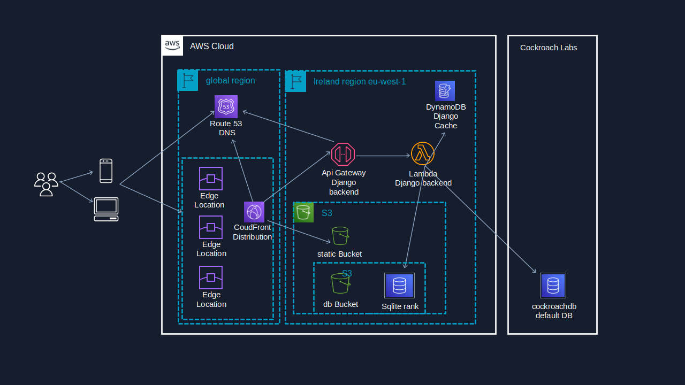

# Progetto Web Fantacitorio 

[](https://github.com//fantacitorio/blob/master/LICENSE) 
[](https://github.com/heyteacher/fantacitorio/commits/main) 
[](https://github.com/django/django) 
[](https://www.python.org/downloads/release/python-390/)

Progetto web __Fantacitorio__ nato dai `Google Sheet` gestiti da [@rosyilcapo](https://twitter.com/rosyilcapo)  per strutturare i dati in un database SQL ed visualizzare le classifiche (generale, per lega, politici). 

In particolare la base dati è stata creata partendo dal `Google Sheet` [* Fantacitorio 2022 - classifica generale PROVVISORIA](https://docs.google.com/spreadsheets/d/19RcqYZYyrCdjMHyFA2bcChaxnd7JIuzjXxYbKNRN3jM/edit?pli=1#gid=0).

__Fantacitorio__ è un _fanta game_ ideato dalla trasmissione __Propaganda Live__ di __La7__ nel 2021. 

Info disponibili:

- [Regolamento](https://www.la7.it/propagandalive/video/fantacitorio-16-02-2022-423442)
- [Monologo di __Valerio Aprea__](https://www.la7.it/embedded/la7?w=640&h=360&tid=player&content=423442)

## Struttura del sito

Il progetto è composto da:

- una sezione pubblica dove sono visualizzate `classifica generale`, le `classifiche per lega`, la `classifica politico` e la possibilità di visualizzare il `dettaglio` di una squadra dove viene mostrata la `formazione`, i `fanfani` utilizzati, il posizionamento in classifica generale e nelle leghe e il `dettaglio del punteggio`

- un'area protetta di `admin ` protetta per importare, esportare r gestione i contenuti:
  - `cariche`
  - `politici`
  - `squadre`
  - `leghe`
  - `associazioni lega-squadra`
  - `punteggi`
  - `puntate`


## Demo

Il deploy sul `Cloud AWS` è raggiungibile al seguente URL:

 https://classifiche-fantacitorio.adessospiana.it

Le credenziali in sola lettura per accedere all' area di amministazione per la gestione dei contenuti per:

- __login__: `fantautente`
- __password__: `fantacitorio`

## Area Developer

In questa sezione viene descritto nel dettaglio lo sviluppo, il popolamento del database e il deploy su AWS. Prerequisito per approcciare questa sezione è di avere una conoscenza almeno base dei seguenti strumenti:

- il linguaggio di programmazione `Python`
- il framework `Django`
- il framework `Zappa`
- il database `sqlite` e `PostgtreSQL` 
- il cloud `AWS` (`Amazon Web Services`) e nello specifico
  - `AWS S3`: l'object storage di AWS
  - `AWS Api Gateway`
  - `AWS Lambda` l'infrastruttura `Serverless/FaaS` (`Function as a Service`)
  - `AWS RDS` il servizio cloud dei DBMS 
  - `AWS CloudFront` la `CDN` (`Content Delivery Network`) di AWS
  - `AWS Route53` il servizio di gestione `DNS` dei domini in  AWS
  - `AWS Certificate` il servizio per creare certificati SSL validi
  

Nella trattazione, la conoscenza di questi strumenti è data per acquisita. Per lo studio e l'approfondimento si rimanda alla documentazione ufficiale di ciascun strumento.

### Il progetto Django

Il progetto è basato sul framework `Django` deployato sul Cloud AWS tramite `zappa`. La lista dei `package python` utilizzati dal progetto sono:

- [django](https://github.com/django/django): storico framework CMS in `python` che, tra i tanti, ha dato i natali ad `Instagram`

- [zappa](https://github.com/zappa/Zappa): tool per il rilascio `serverless` su cloud AWS

- [django-s3-sqlite](https://github.com/FlipperPA/django-s3-sqlite): backend database django per `sqlite` su `AWS S3`

- [django_s3_storage](https://github.com/etianen/django-s3-storage): modulo django per la gestione dalle risorse statiche su `AWS S3`

- [django-dynamodb-cache](https://github.com/xncbf/django-dynamodb-cache): bachend cache django per `AWS DynamoDB`

- [django-tables2](https://github.com/jieter/django-tables2): modulo django che implementa una datadrid avanzata

- [django-filter](https://github.com/carltongibson/django-filter): modulo django che implementa filtri avanzati 

- [django-bootstrap5](https://github.com/zostera/django-bootstrap5): modulo django per utilizzare `bootstrap 3` nei template

- [django-import-export](ttps://github.com/django-import-export/django-import-export): modulo Django per importazione ed espostazione dei dati

- [django-admin-autocomplete-filter](https://github.com/farhan0581/django-admin-autocomplete-filter): modulo Django che implementa i filtri autocomplete nell'admin

- [django-debug-toolbar](https://github.com/jazzband/django-debug-toolbar): modulo Django mostra metriche delle query, template utilizzati, messaggi di log, variabili di sistema, insomma tutto ciò che serve per fare debugging e tuning del sistema

Lo sviluppo è iniziato in locale con db `PostgreSQL`. Per una questione meramente economica, con il deploy su AWS si è passati a `sqlite` quindi i package `django-s3-sqlite`. Naturalmente l'ambiente di produzione ideale prevede l'utilizzo di un vero database come `PostgreSQL` o meglio ancora `AWS Aurora` la versione cloud in alta affidabilità di `PostgreSQL. In tal caso i package sqlite andrebbero sostituiti con i package python:

- `psycopg2` 
- `psycopg2-binary` 

### Struttura 

La struttura del progetto è costituita da un Django `project` a due Django `app`:

- `_fc_project__`: il project che contiene i `settings` e `url resolver`  
- `fc_gestione_app`: app dedicata alla gestione delle squadre, le leghe i politici, le puntate e i punteggi tramite l'`admin` di Django
- `fc_classifiche_app`: app per la generazione/visualizzazione delle classifiche

### Prerequisiti

- `Linux` o `WSL` su `Windows` e forse anche `Windows` (non testato)
- `python3.9` (è attualmente la versione massima supportata dalla `AWS Lambda` in python. Attenzione `python3.10` attualmente non è supportato da `AWS Lambda`)

### Setup local environment

L'ambiente in locale è necessario sia per lo sviluppo dell'applicazione che per il deploy su `AWS. 

- creazione del virtualenv che ospiterà Django in locale
  ```
  sudo apt install virtualenv
  virtualenv  venv --python python3.9 --pip 23.0
  ```

- rinominare `zappa_settings.json.template` in `zappa_settings.json`. Nella sezione dev contiene già le impostazioni per utilizzare il database locale `sqlite3`

- Attivazione del virtualenv creato
  ```
  source venv/bin/activate
  ```

- Installazione di Django e delle dipendenze contenute in requirements.txt
  ```
  pip install -r requirements.txt
  ```

- generazione delle tabelle di sistema della applicazione fc_gestione_app e fc_classifiche_app. si utilizza il `database routing` per gestire il database di principale e quello delle classifiche.
  ```
  python manage.py migrate fc_gestione_app --database default
  python manage.py migrate fc_classifiche_app --database db_classifiche 
  ```

- creazione super utente da utilizzare per autenticarsi al sito (es: `admin`)
  ```
  python manage.py createsuperuser --username <SUPER UTENTE>
  ```

- caricamento dei dati aggiornati alla 6° puntata di propaganda
  ```
  python manage.py loaddata fc_gestione_app
  ```

- generazione delle viste e refresh dei dati di fc_classifiche_app 
  ```
  python manage.py sqlite_create_views
  python manage.py sqlite_refresh_classifiche
  ```

- esecuzione in locale
  ```
  python manage.py runserver
  ```

- accedere a http://localhost:8000, saranno mostrate le classifiche, mentre par accedere all'`admin` cliccare sulla rotellina in alto a destra, quindi autenticarsi tramite il super user creato

### Dump dei dati e creazione della fixture di fc_gestione_app

Per generare una `fixture` del database per migrarlo presso un nuovo ambiente si utilizza il comando Django `dumpdata`

```
python manage.py dumpdata fc_gestione_app -o fc_gestione_app/fixtures/fc_gestione_app.json.bz2
```

Per caricare la `fixture` utilizzare il comando load data (in automatico cerca le fixture dentro l'app0)

```
python manage.py loaddata fc_gestione_app
```

Le `fixture` sono agnostiche rispetto al database utilizzato, quindi possono essere utilizzate per migrare i data verso qualsiasi database supportato da Django.

## architettura su AWS

`zappa` è lo strumento che permette di rilasciare facilmente su cloud `AWS` dell'ambiente di stage e produzione. Nel dettaglio l'architettura del sito sul Cloud:

- Django distribuito sul cloud `AWS` in modalità `serverless` tramite `AWS Lambda` e `AWS Api Gateway` 

- 2 database `sqlite` (`gestione` e `classifiche`) caricati in un `AWS S3 bucket` e acceduto dalla `AWS Lambda` (dove è installato `Django`) per le letture e le scritture, tramite il pacchetto `django-s3-sqlite`.

- `cache Django` attiva su backed `AWS DynamoDB` per le `session` e la `pagine` tramite il pacchetto `django-dynamodb-cache`

- file statici forniti da un `AWS S3 bucket`, built-in `Django`

- `AWS event` schedulato ogni ora per aggiornamento del database classifiche partendo dai dati del database gestione.

- `AWS Cloudfront` le la distribuzione dei contenuti che si occupa anche del routing delle richieste verso la parte statica `S3` oppure il backend servito dalle `AWS Api Gateway`

- con un dominio gestito da `AWS Route53` e certificati di dominio HTTPS generati e gestiti da `AWS Certificate` e configurati sia sul `AWS Cloudfront` che `AWS Api Gateway`    

Il razionale di avere due database distinti, uno per la gestione dei dati e uno per le classifiche è  separare completamente `presentation` dei dati (database classifiche) dalla `administration` dei dati (database gestione):

- il database classifiche è readonly aggiornato ogni ora ottimizzato per la visualizzazione (join risolti, poche tabelle di grandi dimensione non in 3° forma normale). Quando viene consultato dalla lambda viene scaricato da S3 ma non sovrascritto in quanto mai modificato. Quindi può essere acceduto concorrentemente ed è il database della parte pubblica del sito.

- il datatanse di gestione (che è il default) è il classico database in 3° forma normale gestito tramite la `Admin` di `Django` ossia un `CRUD`. Durante le modifiche, viene scaricato da S3, modificato tramite query di INSERT, UPDATE, DELETE e ricaricato su S3. Non supporta accessi concorrenti. E' il database della parte privata di amministrazione del sito, acceduta dall'amministratore per aggiornare i dati.

Il vantaggio di questa configurazione è che utilizza risorse AWS il cui costo è calcolato esclusivamente a consumo e non utilizza risorse AWS a canone come i classici database relazionali (`AWS RDS` con `PostgreSQL`, `Oracle`, `MariaDB`, `MySql`, `Sql Server` ) 
   
L'infrastuttura ha costo praticamente zero fino anche a 100.000 di accessi mensili.

Di seguito lo schema architturale su AWS



### deploy
La configurazione di `Zappa` per il rilascio su AWS è nella  sezione `stage` di `zappa_settings.json`

Come pre-requisito è necessario un account AWS personale con le chiavi configurate in locale per l'accesso all'infartruttura. Di seguito i comandi `Zappa` per il rilascio dell'ambiente di stage: 

1. deploy dell'ambiente (solo la prima volta)++++++
   ```
   zappa deploy stage
   ```
   per aggiornare l'ambiente le volte successive
   ```
   zappa update stage
   ```
   Al termine dell'esecuzione di `deploy` e `update`, se non vi sono errori, viene mostrato il URL del sito rilasciato all'interno della proprio cloud AWS.

1. generazione delle tabelle di sistema della applicazione fc_gestione_app
   ```
   zappa manage stage migrate fc_classifiche_app "--database db_classifiche"
   zappa manage stage migrate
   ```

1. creazione dell'utente superuser di amministrazione
   ```
   zappa invoke stage "from django.contrib.auth.models import User; User.objects.     create_superuser('<SUPER USER>', '', '<PASSWORD>')" --raw
   ```

1. la prima volta: creazione della tabella di caching `AWS DynamoDB`  
   ```
    zappa manage stage createcachetable 
   ```

1. la prima volta: caricamento dei dati presenti nella fixture di fc_gestiona_app 
   ```
   zappa manage stage loaddata fc_gestione_app
   ```

1. creazione delle viste classifiche
   ```
   zappa manage stage sqlite_create_views
   ```

1. primo refresh delle classifiche (comando poi eseguito ogni ora dal `AWS Event`)
   ```
   zappa manage stage sqlite_refresh_views
   ```

### certificato HTTPS e dominio 

Al termine del deploy e update `zappa` mostra l'endopoint esposto sulle `AWS API Gateway` del nostro ambiente, che risulta già navigabile accedendo ad un URL tipo:
```
https://<STRINGA-RANDOM>.execute-api.eu-west-1.amazonaws.com/stage
```

Se si ha a disposizione un dominio gestito su `AWS Route53`, è possibile generare un certificato valido HTTPS sul nostro dominio. I certificati creati `AWS Certificate` possono essere utilizzati nelle risorse `AWS` sono gratis e `AWS` si occupa di rinnorarli in automatico dopo la scadenza annuale.

Quindi dopo aver generato e validato il certificato HTTPS sul dominio, si copia il suo `ARN` dentro `zappa_setting.json` nel campo `"certificate_arn"` e si valorizza il dominio nel campo `domain`. Tramite il comando:

```
zappa certify stage
```

`zappa` si occupa di:

1. creare un `Custom Domain` mappandolo allo stage delle `AWS API Gateway` 
1. associa il certificato HTTPS il cui `ARN` è configurato nei settings 
1. creare le entry sul DNS del dominio `AWS Route53` che puntano alle `AWS API Gateway` del nostro ambiente

Al termine dell'esecuzione il comando mostra l'URL in HTTP del nostro domino che punta all'ambiente deployato: `https://miodominio.com`

### AWS CloudFront

`CloudFront` è la CDN (`Content Delivery Network`) di `AWS` per ottimizzare la distribuzione dei contenuti utilizzando i `CloudFront Edge` ossia mirror dei contenuti distribuiti in modo capillare nel mondo minimizzando latenza e massimizzando la velocità di fornitura dei contenuti agli utenti finali.

`CloudFront` inoltre gestisce anche come fornire i contenuti in base a dove sono localizzati nelle `Origin` ossia le applicazioni o i contenuti esporti. Nel caso particolare di un progetto Django, a fronte di una richiesta di una pagine, `CloudFront` interroga:

- le `AWS API Gateway` per i contenuti dinamici, ossia le pagine generate da Django
- l' `AWS S3 Bucket` per i contenuti statici di Django (immagini, CSS, JavaScript)

La configurazione di `CloudFront` per le applicazioni `Django` deployate con `zappa` è particolare e ha richiesto diversi tentativi prima di arrivare ad una soluzione soddisfacente:

1. definito il dominio `fc-project-api-stage.adessospiana.it` per le `AWS API Gateway` che ospitano la  `AWS Lambda` di `Django`, configurando `zappa_setting.json` ed eseguento `zappa certify stage`

1. creato la distribution `CloudFront` con le due origin:
   * l'origin Custon `fc-project-api-stage.adessospiana.it`
   * l'origin S3 `fc-zappa-static` 

1. configurati i `beaviour` ossia le regole di distribuzione come segue:
   * tutte le richieste `/static/*` sono indirizzate all'origin `fc-zappa-static` 
   * tutto il resto `Default (*)` viene indirizzato alla origin custon `fc-project-api-stage.adessospiana.it` 

1. Per il `beaviour`  `Default (*)` è stata specificato il passaggio dei `Cookie` alla Origin dato che di default ciò non avviene. Di seguito la configurazione del `beaviour` 

## Deploy su AWS con database `AWS RDS` di `PostgreSQL`

In alternativa, è possibile deployare su AWS il progetto utilizzando un database di classe enterprice come `PostgreSQL` e fornito da AWS tramite il servizio `AWS RDS`. Naturalmente in questi casi i costi aumentano dato che il database si paga dal momento che si avvia e non solo quanto viene utilizzato.

Essendo una soluzione enterprise, per convenzione l'ambiente è stato ribatezzato `production` anche se non è stato deployata su AWS l'ambiente di `stage` sopra descritto. Per comodità in locale il database è stati disegnato usando PostgreSQL è lo strumento `PgAdmin` (vedi sezione di seguito). 

1. installare i pacchetti python con il requirement specifico:
  ``` 
  pip install -r requirements_production.txt
  ```

1. configurare la sezione `production` del file `zappa_settings.json`

1. deployare l'applicazione nel cloud
  ```
  zappa deploy production
  zappa manage production migrate
  zappa manage production createcachetable
  zappa invoke production "from django.contrib.auth.models import User; User.objects.create_superuser('<SUPER USER>', '', '<PASSWORD>')" --raw
  zappa manage production loaddata fc_gestione_app
  zappa manage production pg_create_views
  zappa manage production pg_refresh_classifiche
  ```

## Creazione progetto Django

A titolo digulgativo, questa sezione mostra la genesi del progetto descrivendo i comandi per crearlo e il modo in cui è stata disegnata la base dati.

Di seguito i comandi iniziali con cui sono stati creati:

```
django-admin startproject fc_project .
django-admin startapp fc_gestione_app
django-admin startapp fc_classifiche_app
```

Inizialmente il database di `fc_gestione_app` è stato creato graficamente con `PgAdmin ERD` poi generato nel postgres locale. 

Di seguito lo schema ER generato da PgAdmin ERD:


Quindi i models di Django sono stati creati tramite `reverse engineering` con il comando `inspectdb`

```
python manage.py inspectdb > fc_gestione_app/models.py
```

I models Django di `fc_classifiche_app` sono stati creati manualmente sulle tre viste materializzate e non gestite da Django (vedi nei models `managed=False`)

La configurazione inziale di `Zappa` è stata generata eseguendo il comando `zappa init` __eseguito dentro il virtualenv del progetto__. In questo modo riconosce l'ambiente Django installato nel virtualenv e crea il file `zappa_setting.json` tramite un wizard. 

## Per Contribuire

puoi contribuire:

* eseguendo un `fork` del progetto e contribuendo allo sviluppo 
* segnalando malfunzionamenti
* suggerendo nuove funzionalità

Aprendo una [segnalazione](https://github.com/heyteacher/fantacitorio/issues/new).
